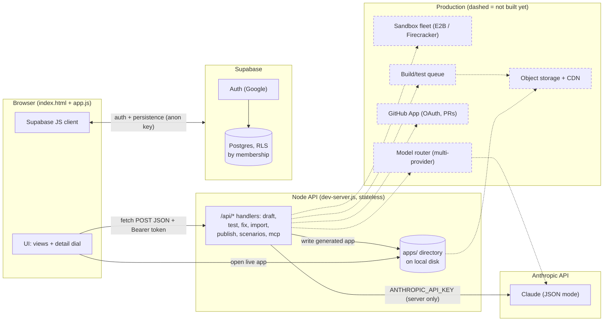

# Architect — Architecture

Architect is a vibe-coding platform: a user types a plain-language description of an app and gets a
**blueprint**, simulated **test scenarios**, an approval gate, and a **deployed, runnable app**. One
product serves two audiences through a single "detail dial": business users stay in plain language,
developers flip to code — same project, no forked views.

The repo is deliberately small and dependency-free. The whole backend is one Node process
(`dev-server.js`, ~90 lines, zero npm packages) that serves static files, exposes seven JSON
endpoints, and serves the generated apps. The whole frontend is two files (`index.html`, `app.js`).
What follows describes what *actually* runs today, and — where marked **Production** — what the
design becomes at scale.



Solid edges run today; dashed boxes and edges are the production design.

---

## 1. From prompt to live app

The happy path, end to end:

1. **Sign in.** The browser loads `/api/config` and gets the Supabase URL, the anon key, and the
   monthly credit cap. The user signs in with Google (or an email link) via Supabase Auth; the
   browser holds a JWT and sends it as `Authorization: Bearer …` on every API call.
2. **Describe.** On the home screen the user types up to 1500 characters (hard cap in
   `api/draft.js`) and picks an agent framework. The browser POSTs `{description, framework}` to
   `/api/draft`.
3. **Draft.** `/api/draft` verifies the JWT against Supabase, then **spends one credit**: the
   Postgres RPC `use_credit(p_cap)` atomically increments the user's row in `usage` and returns
   false past the monthly cap (`CREDIT_CAP_MONTHLY`, default 100). Only then does it call Claude
   with a structured prompt demanding JSON only, shaped as a name plus four "lanes" (screens,
   agents, data, connections), each item with a `title`, a plain-English `plain`, and a short
   `code` snippet. Malformed model output is a 502, not a crash.
4. **Shape.** The blueprint renders as a canvas; chat edits propose changes the user keeps or
   undoes. `/api/scenarios` can auto-propose 7 test cases (happy path, edge, parsing, permission,
   language, lifecycle).
5. **Test.** Each scenario POSTs to `/api/test`, which asks Claude to simulate the design step by
   step — honouring thresholds, permissions, and connection scopes — and return a trace with
   per-step bad flags plus a one-sentence design fix on failure. `/api/fix` turns a failing trace
   into a concrete `code_change`. Signed-in runs persist to `test_runs`.
6. **Approve.** Production deploys are gated on: all scenarios passing, permissions reviewed, and
   human sign-off in `approvals`.
7. **Deploy.** `/api/publish` asks Claude for a **complete, self-contained HTML app** — every
   screen as a real view, mock data, agent behaviour simulated deterministically in inline JS,
   disallowed actions visibly disabled — as JSON `{"index.html": "<file>"}`. The server slugifies
   the name, writes `apps/<slug>-<env>/index.html`, and returns `/app/<slug>-<env>/`. Signed-in
   deploys are recorded in `deployments`.
8. **Live.** The same Node process streams the file off disk (`dev-server.js:69-78`). No build, no
   runtime, no container — the app *is* a static file.

Total moving parts on this path: browser → one Node handler → one Claude call → disk.

---

## 2. Sandboxes

**Today: there is no sandbox, because there is nothing to sandbox.** The only model artifact is a
single self-contained HTML file with inline CSS/JS, no external dependencies, no server-side
component. The server *writes* the file; it never *executes* model output. The file's JavaScript
runs only in the **end user's own browser**, on that user's origin — the same trust domain as any
static webpage. Model output is handled strictly as data: parsed as JSON, length-checked
(`html.length < 500` is rejected), written verbatim. That is the entire security boundary, and it
is sound for a prototype: a prompt-injected model can at worst produce a malicious page served from
your domain (a real gap — see §11), but it cannot touch the server, the filesystem outside `apps/`,
or other tenants.

**Production:** once generated apps are real code — Node/Python backends, agent runtimes that call
tools and hold secrets — "write to disk and serve" is no longer acceptable. The design is a
**sandbox fleet**:

- **E2B** (managed microVMs) or self-hosted **Firecracker microVMs** for per-run isolation. Why
  microVMs and not containers: agent execution needs a boundary that survives hostile or merely
  buggy generated code — arbitrary syscalls, fork bombs, metadata-endpoint network egress.
  Firecracker gives KVM-grade isolation with ~125 ms startup and a minimal device surface; each
  build/test run gets a fresh VM, a wall-clock and memory budget, and is destroyed afterwards. E2B
  is the same property without operating KVM.
- Each sandbox holds **no platform secrets**, talks out through an allow-listed egress proxy, and
  mounts only its own workspace; the agent harness streams tool calls in and results out.
- The fleet autosizes on queue depth (§10): a warm pool for interactive latency, scale-to-zero
  off-peak.

---

## 3. The agent harness

**Today the "harness" is stateless, single-shot endpoints.** Each handler is a hand-written
structured prompt: the system message pins "Reply with JSON only", the user message embeds the
blueprint (capped at 6 KB) plus the task, and the reply is parsed and validated
(`api/_lib.js:40-78`). No memory between calls — the browser carries blueprint state and re-sends
it — and no tool use: the model answers, the handler acts. Every call has an `AbortController`
timeout (30–90 s by stage) so a hung model request can't pin the server. This honest statelessness
means the server can be killed and restarted mid-request with zero corruption, at the cost of the
client retrying.

**Production** turns each stage into a **plan → write → run → observe → recover** loop:

- **Plan:** a stronger model decomposes the blueprint into a task graph.
- **Write:** files are emitted as tool calls (`write_file`, `edit_file`), not one giant JSON blob —
  removing the output-token and blueprint-size ceilings that today cap app complexity.
- **Run:** code executes in a sandbox (§2), not in the model's imagination.
- **Observe:** test exit codes, screenshots, and traces feed back as context.
- **Recover:** on failure the loop retries with the error, rolls back to a checkpoint (every tool
  call is journaled), and escalates to the user after N attempts.

That turns the model from an oracle into a worker whose mistakes are recoverable by construction.

---

## 4. Model-agnosticism

**Today: Claude only.** All model traffic goes through `claudeJSON()` in `api/_lib.js`; the model
is configurable via `ANTHROPIC_MODEL` (default `claude-haiku-4-5-20251001`). The key lives
exclusively server-side; the browser never sees it. The product is already agnostic in one
dimension — the user picks an agent framework (LangGraph, CrewAI, Lyzr ADK, OpenAI Agents SDK,
Google ADK), which changes prompt text and generated code style only.

**Production:** a **provider router** behind one interface: `generate(stage, {system, prompt,
schema, budget})`.

- Providers: Anthropic native, any OpenAI-compatible endpoint, Gemini, and open-weight models on
  **vLLM** for cost-sensitive bulk work.
- **Model named per stage:** drafting wants reasoning, scenario simulation wants
  instruction-following, generated-app code wants long output. Cheap models for cheap stages,
  frontier models for plan/fix — with a typed JSON contract between stages either way.
- **Fallback chain:** on provider error or timeout, retry on the next provider, so an outage
  degrades latency instead of taking the product down.
- **Eval-gated promotion:** a model reaches production by shadowing the incumbent on real
  blueprints and matching its pass rates and JSON validity on the scenario suite — not because a
  benchmark looked good.

---

## 5. Frontend ↔ backend

The contract is deliberately thin:

- **One pattern:** the browser `fetch`-es `POST` with a JSON body and bearer token; the server
  replies with JSON. No WebSockets, no SSE, no sessions. Rendering is client-side string templates
  in `app.js` — no framework, no build step — with Supabase as the source of truth each view
  re-reads.
- **Statelessness** means any handler can serve any request; all state lives in Postgres or the
  request body (§10).
- **Live preview** is opening the generated static app at `/app/<slug>-<env>/` — origin-isolated
  from the platform UI and needing no API of its own.
- The frontend also talks **directly to Supabase** for auth and CRUD (§9); the Node tier is only
  the AI/proxy layer, not a general BFF. That shrinks the server's blast radius: compromised, it
  holds one model key and can spend credits, but user data stays behind Postgres RLS.

---

## 6. The proxy principle

The server exists, in large part, to be **the only place secrets live**.

- `ANTHROPIC_API_KEY` (and optional `GITHUB_TOKEN`) are server-side env vars. The browser receives
  exactly one credential — the **Supabase anon key**, via `/api/config` — safe because row-level
  security, not the key, decides what any user can read or write.
- **Credit caps are enforced where the money is spent**, server-side, in Postgres, atomically
  (`use_credit`, `supabase/schema.sql:152-166`). The client-side meter is cosmetic; the cap is not.
- Every AI call is tied to a verified identity: the handler asks Supabase "who owns this token?"
  before spending anything.
- `ALLOW_ANONYMOUS_DRAFT=true` is the documented **dev-only escape hatch**: it skips auth *and* the
  credit cap so a developer can try the product without wiring up Supabase Auth. Marked as a danger
  flag in `.env.example` and the README; never set it publicly — with it on, anyone who finds the
  URL can spend your Anthropic balance.

This is the "dumb proxy, smart database" posture: the API tier is replaceable, and the secrets
aren't anywhere they can be phished from.

---

## 7. GitHub integration

**Today: import only.** `/api/import` takes `owner/repo` (validated against `/^[\w.-]+\/[\w.-]+$/,
capped at 100 chars), reads the repo's git tree via the public GitHub API (no token needed;
`GITHUB_TOKEN` unlocks private repos), pulls up to four manifests (`package.json`,
`pyproject.toml`, `requirements.txt`, `Cargo.toml`, `go.mod`, first 600 chars each), computes stack
facts (file counts, agent-like filenames), and asks Claude to map it all to a blueprint — returning
the raw `stack` facts alongside so the user sees what was actually understood before anything
changes. Purely read-and-map.

**Production: a proper GitHub App.** OAuth installation per workspace; each project gets a repo;
deploys push branch `architect/change-N`, open a PR, and gate production on PR review/CI — folding
generated changes into review workflows teams already trust instead of a black box. The App model
also fixes today's gaps: installation-scoped tokens (not a personal PAT), webhook-driven
re-imports, and signed commits for provenance.

---

## 8. Deployment

**Today: filesystem + one static server.** `/api/publish` writes `apps/<slug>-<env>/index.html`
(plus a generated README) and `dev-server.js` serves `/app/*` with path-traversal guards
(`replace(/\.\./g, '')` plus a prefix check against the apps root). Two environments are just two
directories; "production is locked" is a UI gate, not a server rule.

The **platform itself** runs on **Render**: stateless Node, env vars from the dashboard, auto-deploy
from GitHub, no build step — `node dev-server.js` is the whole start command. (`vercel.json`
remains as a single-function alternative.)

Honest limitations: disk is ephemeral (a clean redeploy loses generated apps — treat them as
reproducible artifacts, rebuildable from blueprint + prompt), and there is no atomicity, rollback,
or per-app domain.

**Production:** a **build queue** (§10) turns blueprints into artifacts; artifacts go to **object
storage + CDN** with immutable content-addressed URLs, instant rollback, and per-project subdomains
on a separate origin from the platform UI (closing the §11 gap). Staging and production become real
environments with separate secrets.

---

## 9. Persistence

Supabase Postgres is the single source of truth (`supabase/schema.sql`):

| Table | Holds |
|---|---|
| `workspaces` / `members` | Client workspaces; membership + role (`define`/`build`/`approve`) |
| `projects` | Each app, blueprint as `jsonb` |
| `changes` | Chat-proposed changes (`pending`/`kept`/`undone`) |
| `comments` | Preview annotations |
| `approvals` | One sign-off record per project |
| `test_runs` | Real scenario results: status, JSON trace, suggested fix |
| `deployments` | Real generated-app deployments |
| `usage` | Credits per user per month (drives the cap) |
| `connection_events` | MCP tool calls from connected coding agents |

**Access control is RLS by membership.** A `security definer` `is_member(ws)` function gates every
project-scoped table, so a leaked anon key still only sees rows in workspaces its user belongs to.
First sign-in seeds three demo clients via `ensure_demo_workspace()`.

What gets stored **when signed in**: blueprint and edits, comments, approvals, test runs with
traces, deployments, usage, MCP events — everything that makes a project resumable and auditable.
What never gets stored: the Anthropic key (env var) and any third-party connection secret
(connections are declared in the blueprint, not credentialed, in this prototype).

---

## 10. Scaling to thousands of concurrent users

The design scales because the expensive things are already isolated:

- **API tier:** stateless by construction → horizontal behind a load balancer; N identical
  processes, no session affinity, no in-memory state.
- **State:** managed Postgres with pooling. The hot write is one atomic row increment per credit —
  trivially concurrent.
- **The bottleneck is model calls.** LLM latency × concurrency would saturate a
  request-per-process model, so production puts model work on a **queue** (draft/test/fix/publish
  become jobs; workers pull; clients get progress over websocket/poll), plus **per-user rate
  limiting** (the credit cap is the coarse version already) and per-provider concurrency limits.
  Queuing also retries without holding HTTP connections open.
- **Sandbox fleet** (§2) autosizes on queue depth — warm pool for interactivity, scale-to-zero
  off-peak.
- **Generated apps** — the read-heaviest path — move to object storage + CDN, off the platform
  servers entirely.
- **Cost model per stage** (Haiku-class): drafting ≈ 2k output tokens, each scenario ≈ 1.5k,
  publishing ≈ 8k. One published app with 7 scenarios ≈ 20k output tokens: a known, per-user-capped
  unit of cost. The `usage` table is the foundation for per-client budgets (the settings UI already
  shows "3,000/mo for this client") and margin math.

---

## 11. Security

- **Server-side keys only.** `ANTHROPIC_API_KEY` and `GITHUB_TOKEN` never leave the server; the
  browser gets the RLS-guarded anon key only (§6).
- **RLS everywhere.** Every table has membership-keyed row-level policies; helper functions are
  `security definer` with a pinned `search_path` (the two classic SQL-injection-via-function
  footguns).
- **Input caps.** Description 1500 chars, scenarios 600, names 60, blueprint 6 KB per prompt,
  framework strings sanitized to `[a-z_]`. Prompt injection from a malicious description isn't
  eliminated — it's contained: model output is handled as data, and the credit cap bounds
  burn-rate.
- **JSON-only model outputs**, pinned by system prompt, with fence-stripping and a hard
  parse-failure path (502, no partial state).
- **No `eval`, ever.** Model output is parsed as JSON and written to files; it is never executed
  server-side. The only execution is the end user's own browser running the generated static page.
- **Hardened static serving:** traversal stripped and prefix-checked, security headers on every
  response (`nosniff`, `frame-ancestors 'none'`, a tight CSP), 30–90 s timeouts on all model calls.
- **Known prototype gap:** generated apps are served from the platform origin, so a prompt-injected
  page is same-origin with the platform UI. Production moves them to their own domain (§8).

---

## How to run

```bash
cp .env.example .env   # fill in SUPABASE_URL, SUPABASE_ANON_KEY, ANTHROPIC_API_KEY
node dev-server.js     # or: npm start
```

Open http://localhost:3000. Port comes from `PORT` (default 3000). Without a `.env` the server
still runs as a demo — AI calls are simply disabled. Set `ALLOW_ANONYMOUS_DRAFT=true` only for
local development; it skips sign-in and the credit cap and must never be enabled on a public
deployment.
