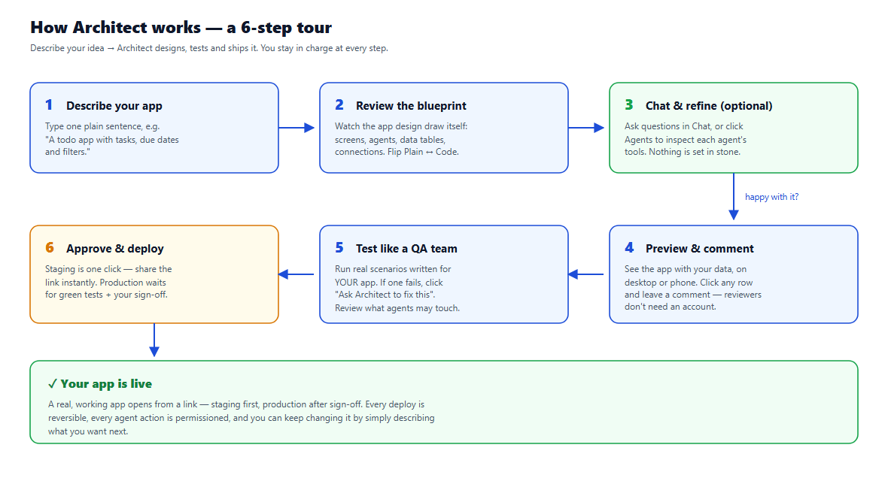

# Architect — User Guide

Share this with anyone trying the app. No technical background needed.

---

## Step by step

### 1. Open the app and start
- Go to the app URL (your Render link, or `http://localhost:3000` when running locally).
- **No sign-up needed to try things** — you can draft and preview right away. Signing in (Google) only saves your projects between visits.

### 2. Describe your app
- On the home screen, type **one plain sentence** about the app you want, e.g.
  > *"A todo app where users add tasks, mark them done, and filter by today or this week."*
- Press Enter / submit. In about 10–20 seconds the **blueprint draws itself** on screen.

### 3. Read the blueprint
The blueprint has four lanes:
- **Screens** — what users see
- **Agents** — the AI workers
- **Data** — the tables stored
- **Connections** — what the app talks to (email, docs, APIs…)

- Click any block to see what it connects to.
- Use the **Plain / Code** toggle (top right): *Plain* explains everything in everyday language; *Code* shows the real React / Python / SQL.

### 4. Refine in Chat or Agents (optional)
- **Chat** (left sidebar): ask anything — "What should I build first?", "Review my blueprint". Architect knows your project and answers in context.
- **Agents** (left sidebar): see each agent's job, the tools it can use, and test it.

### 5. Preview like a reviewer
- Open the **Preview** tab: the app shows your real data tables (mock rows), on desktop or phone.
- Turn on **Comment**, click any row, leave feedback. The "Copy review link" button lets a client comment **without an account**.

### 6. Test it before trusting it
- Open the **Test** tab. Architect wrote these scenarios specifically for *your* app.
- Click a scenario to run it for real. If one fails, click **"Ask Architect to fix this"** — it repairs the blueprint and re-runs the test.
- Right side: check **what the agents are allowed to do**. Anything that sends email or writes data is flagged until a human reviews it.

### 7. Approve and deploy
- **Staging** (Deploy tab): always available — one click, then share the link.
- **Production**: unlocks only when all tests pass, permissions are reviewed, and sign-off is given. The platform enforces this; you don't have to remember.

### 8. Keep improving
- Go back to the blueprint and type a change in the command bar, e.g. *"email me a weekly summary"* — or just describe the change in Chat. Then test and deploy again.

---

## The one rule that makes it safe
**Staging is open, Production is earned.** Anyone can experiment; nothing reaches your users until tests pass, permissions are reviewed, and a person says yes.

## Quick reference
| I want to… | Where |
|---|---|
| Create an app | Home → type a description |
| See what it looks like | **Preview** tab |
| Check it's reliable | **Test** tab → run scenarios |
| Control what agents may touch | **Test** tab → permissions |
| Let a client comment | **Preview** → Copy review link |
| Ship it | **Deploy** tab → Deploy to staging |
| Go live | **Deploy** tab → approve → Production |
